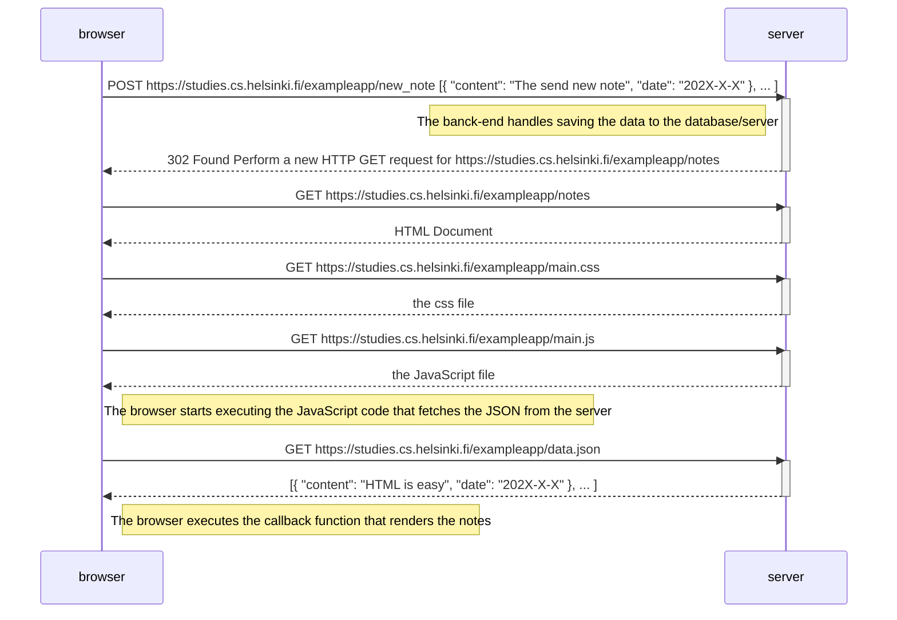
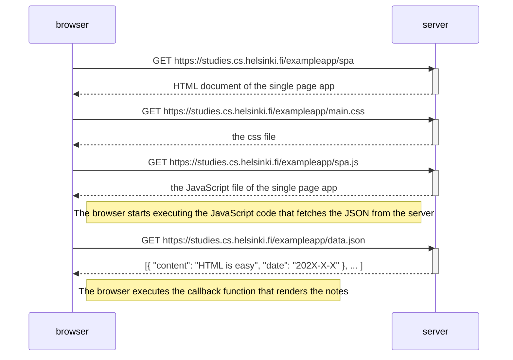
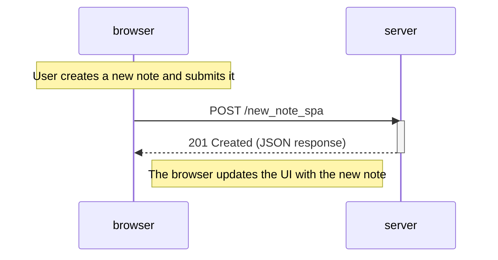

Exercise 0.4 New note diagram

We start by assuming the page html and javascript has already ran.

Exercise 0.5 Single page app diagram

Because it is the first download of the page the diagram looks really similar to the original/normal version of the page.

Exercise 0.6 New note in Single page app diagram

